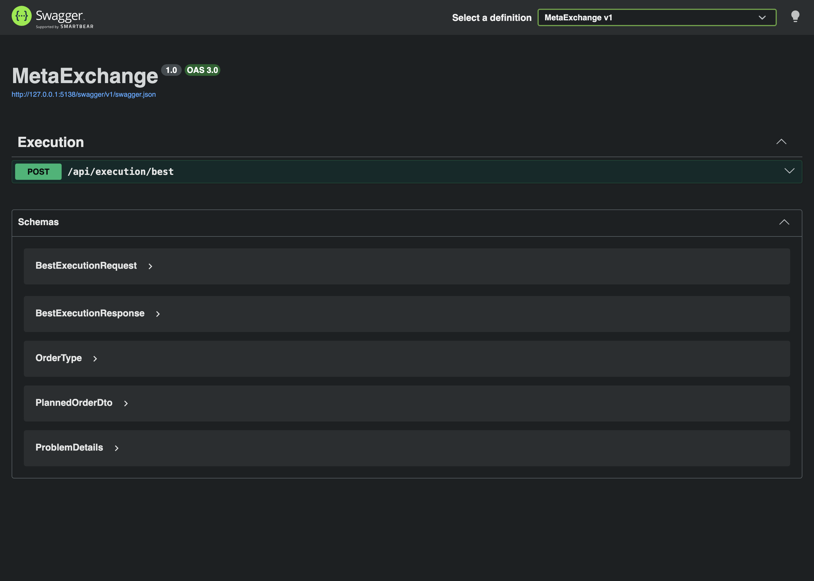
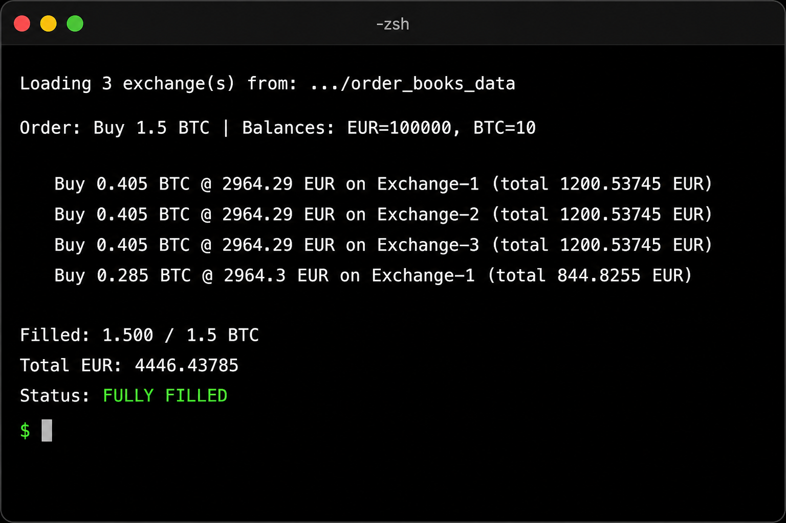

# MetaExchange

A .NET meta-exchange that plans the best BTC buy/sell execution across multiple crypto exchanges, respecting each exchange’s EUR and BTC balances.



## How it works

You are given several exchanges, each with:

- an **order book** (bids and asks in EUR/BTC)
- **EUR** and **BTC** balances

Given an order type (`Buy` / `Sell`) and a BTC amount, MetaExchange builds an **execution plan**: one or more orders to place on those exchanges so that:

- a **buy** fills at the **lowest** available ask prices
- a **sell** fills at the **highest** available bid prices
- funds are **not** transferred between exchanges — each fill is limited by that exchange’s local balance and book liquidity

Algorithm (simplified):

1. Collect all relevant book levels across exchanges (asks for buy, bids for sell).
2. Sort them by price (best first), then by exchange id for stability.
3. Walk the levels and take as much as possible at each level, capped by remaining request size and that exchange’s remaining balance.
4. Return the planned orders plus fill totals (`FilledAmountBtc`, `TotalEur`, `IsFullyFilled`).

Core logic lives in `MetaExchange.Core` (`MetaExchangeService`). The **console** and **API** projects are thin hosts around it.

```
MetaExchange.Core      # models + best-execution + order-book loading
MetaExchange.Console   # CLI host
MetaExchange           # ASP.NET Core API + Swagger
MetaExchange.Tests     # unit tests
```

## Prerequisites

- [.NET 10 SDK](https://dotnet.microsoft.com/download)
- (optional) Docker, for running the API in a container

## Build & test

```bash
dotnet build MetaExchange.slnx
dotnet test MetaExchange.Tests/MetaExchange.Tests.csproj
```

## Run the console app

```bash
dotnet run --project MetaExchange.Console
```

Defaults: buy **1 BTC** across **3** exchanges from `order_books_data`, with EUR `100000` and BTC `10` balances on each exchange.

Example:

```bash
dotnet run --project MetaExchange.Console -- \
  --type Buy \
  --amount 1.5 \
  --exchanges 3 \
  --eur 100000 \
  --btc 10
```



| Argument | Description | Default |
|----------|-------------|---------|
| `--file` | Path to order-books file (one JSON book per line) | `order_books_data` |
| `--exchanges` | Number of exchanges to load from the file | `3` |
| `--type` | `Buy` or `Sell` | `Buy` |
| `--amount` | BTC amount to trade | `1` |
| `--eur` | EUR balance per exchange | `100000` |
| `--btc` | BTC balance per exchange | `10` |

Exit codes: `0` fully filled, `2` partial fill, `1` error (e.g. missing data file).

## Run the API

```bash
dotnet run --project MetaExchange
```

Then open Swagger UI:

- [http://localhost:5138/swagger](http://localhost:5138/swagger)

### Endpoint

`POST /api/execution/best`

Request:

```json
{
  "orderType": "Buy",
  "amountBtc": 1.5
}
```

Example with curl:

```bash
curl -s http://localhost:5138/api/execution/best \
  -H "Content-Type: application/json" \
  -d '{"orderType":"Buy","amountBtc":1.5}'
```

Configuration (`appsettings.json` → `MetaExchange`):

| Setting | Meaning | Default |
|---------|---------|---------|
| `OrderBooksFilePath` | Order-books data file | `order_books_data` |
| `ExchangeCount` | How many books to load | `3` |
| `DefaultEurBalance` | EUR balance per exchange | `100000` |
| `DefaultBtcBalance` | BTC balance per exchange | `10` |

### Docker

```bash
docker build -t metaexchange .
docker run --rm -p 8080:8080 metaexchange
```

Swagger: [http://localhost:8080/swagger](http://localhost:8080/swagger)
